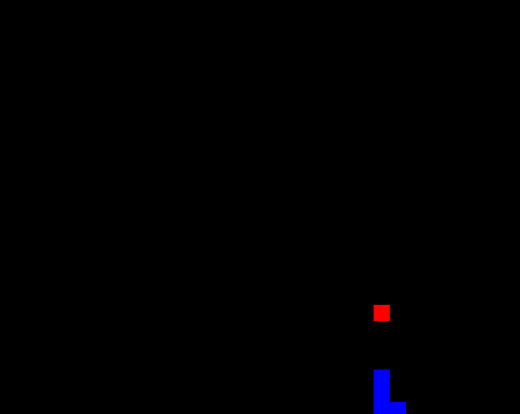

# Snake Game

## Overview

This project is an implementation of the classic Snake game using the `SFML library`. The player controls a snake, which must navigate around the screen, consuming apples to grow longer while avoiding walls and itself. The game includes multiple levels with increasing difficulty, as well as different game states such as running, paused, and game over.

## Features

- **Gameplay**: Control a snake to consume apples and grow longer.
- **Levels**: Multiple levels with increasing difficulty.
- **Walls**: Avoid walls as you progress through the game.
- **Game States**: Includes running, paused, and game over states.
- **Apple Spawning**: Apples spawn randomly on the game board for the snake to consume.
- **Childhood Snake Game**: Relive the classic childhood Snake game.

### Gameplay

You start the game on level 1 and keep going until you hit yourself or a section of the wall. The speed increases each time you advance to a new level or when you eat a delicious apple.

### About the Levels

The levels are stored in text files. How does it work?

The screen is designed to be 800x600 pixels, with each wall section being 20x20 pixels.

By dividing the size of the wall sections by the width and height, you get a grid of 40 columns and 30 rows. Therefore, the text files should contain 40 characters per line and 30 lines in total.

You can calculate the position of the character `X` to place it exactly where you want on the screen.

## Customize Your Own Levels

You can create custom levels for the Snake game by following these steps:

1. **Create a Level File**: The levels are stored in text files. To create your own level, create a new text file and save it in the same directory as the other level files.

2. **Design the Level**: In the text file, design your level using the character 'X' to represent walls and open spaces. Here's how the grid works:
    - The screen is designed to be 800x600 pixels, with each wall section being 20x20 pixels.
    - This setup divides the screen into a grid of 40 columns and 30 rows.
    - Each line in the text file should contain exactly 40 characters, representing the columns, and there should be 30 lines total, representing the rows.
    - Use 'X' to place walls in the grid, with each 'X' representing a wall section.
    
3. **Save the File**: Save the level file with a meaningful name, such as `level1.txt`.

4. **Add the Level to the Game**: Add your custom level file to the game's directory. The game will load the levels from text files, so ensure your custom level file is in the correct format and location.

5. **Play the Game**: When you start a new game, your custom level should be loaded if it is the first in the list of level files.

By following these steps, you can easily design and play your own custom levels in the game. Experiment with different wall configurations and challenge yourself to complete new, unique levels!

For more specific information about creating levels or troubleshooting, refer to the source code in the provided files and the associated comments.

## Getting Started

### Prerequisites

- **SFML**: This project uses the Simple and Fast Multimedia Library (SFML). You need to have SFML installed on your system.
- **CMake**: This project uses CMake for building and managing dependencies.
- **note**: these are only important if you are planning to look on the source code, if you are just here to play you can dive right in and also you stil can add your own levels to the game using txt files as mentioned before.  
## Usage

- Use the arrow keys to control the snake:
  - Up: `Up Arrow`
  - Down: `Down Arrow`
  - Left: `Left Arrow`
  - Right: `Right Arrow`
- Press `Escape` to close the game.
- When the game is over, it will restart upon any key press.

## Project Structure

- **main.cpp**: Entry point of the application.
- **Apple.cpp / Apple.h**: Implementation and declaration of the Apple class.
- **mysnake.cpp / mysnake.h**: Implementation and declaration of the `mysnake` class.
- **snakegame.cpp / snakegame.h**: Implementation and declaration of the `SnakeGame` class.
- **CMakeLists.txt**: Configuration file for building the project with CMake.

## Future Plans

1. Add textures to the snake and apple, enhancing the visual experience.
2. Include necessary text (e.g., instructions, game status) for a more polished user experience.
3. Provide a mode for users to create custom levels. While this is currently possible using text files, it would be more user-friendly to offer an interface for users to select blocks on the screen and generate a text file for the level.

## Game Play

## Contact

For any questions or feedback, you can contact me via email at [mahmoudnaif788@gmail.com](mailto:mahmoudnaif788@gmail.com).
